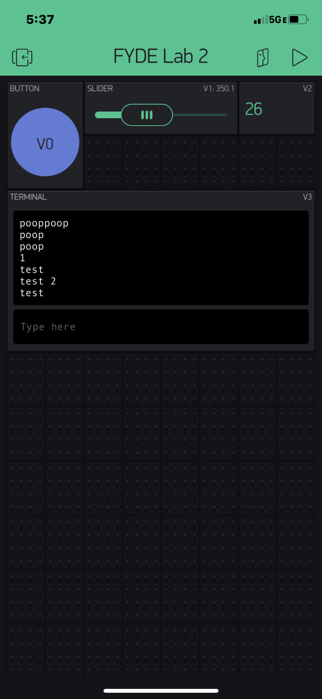

Name:Jacob George

EID:jcg4728

Team Number:F8

## Questions

1. What is the purpose of an IP address?

    TO give a device a signature or way to be identified and connected with. 

2. What is a DNS? What are the benefits of using domain names instead of IP addresses?

    Domain Name Server, it allows humans to type server names in english and have the 
    computer translate it into IP. 

3. What is the difference between a static IP and a dynamic IP?

    Static does not change while dynamic usually changes each time the device connects to a new network. 

4. What is the tradeoff between UDP and TCP protocols?

    UDP is much quicker, but TCP is reliable and secure. 

5. Why can't we use the delay function with Blynk?

    Delay is a blocking function which would break the timing of 
    Blynk's event based programming.

6. What does it mean for a function to be "Blocking"?

    It means the function does not allow for other portions of the program to be running 
    at the same time as the function. 

7. Why are interrupts useful for writing Non-Blocking code?

    They allow for other functions to continue running until the interrupting function needs to be run. 

8. What is the difference between interface and implementation? Why is it important?

   Interface is the skeleton of a program that previews the functions and shows the pattern.
   Implementation is the definition of functions and the actual steps of the program. 

9. Screenshot of your Blynk App:

    
